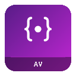
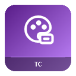
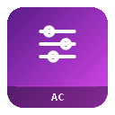
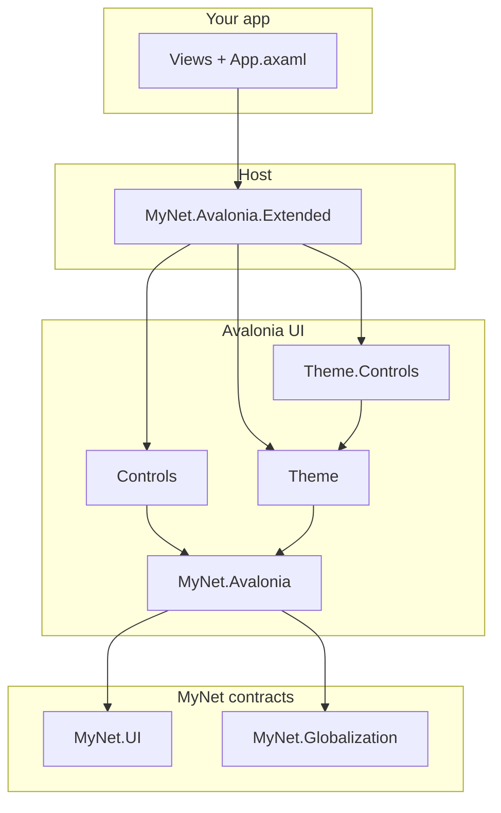

<div align="center">

# MyAvalonia

**Avalonia UI layer for the MyNet suite** — themed controls, design tokens, globalization markup, and host adapters for **MyNet.UI** (dialogs, navigation, toasts, theming).

[](https://github.com/sandre58/MyAvalonia/blob/main/LICENSE)
[](https://github.com/sandre58/MyAvalonia/issues)
[](https://github.com/sandre58/MyAvalonia/graphs/contributors)
[](https://github.com/sandre58/MyAvalonia/commits/main/)
[](https://github.com/sandre58/MyAvalonia)

[](https://dotnet.microsoft.com/download/dotnet/10.0)
[](https://github.com/sandre58/MyAvalonia/search?l=c%23)
[](https://www.nuget.org/packages?q=MyNet.Avalonia)


[](https://github.com/sandre58/MyAvalonia/actions/workflows/ci.yml)
[](https://codecov.io/gh/sandre58/MyAvalonia)
[](https://codecov.io/gh/sandre58/MyAvalonia/tree/main)


[](https://semver.org/)
[](https://www.conventionalcommits.org/)


[](https://github.com/sandre58/MyAvalonia/stargazers)
[](https://github.com/sandre58/MyAvalonia/network/members)

[Documentation](docs/index.md) · [Getting started](docs/getting-started.md) · [Guides](docs/guides/README.md) · [MyNet (companion)](https://github.com/sandre58/MyNet) · [Releases](https://github.com/sandre58/MyAvalonia/releases) · [Report a bug](https://github.com/sandre58/MyAvalonia/issues)

</div>

---

## 📋 Overview

**MyAvalonia** is the **Avalonia-specific** companion to [MyNet](https://github.com/sandre58/MyNet): six focused NuGet packages that bring the MyNet look, markup extensions, and MVVM shell contracts to cross-platform desktop (and optional browser/mobile) Avalonia apps.

| Highlight | Description |
| :-------- | :---------- |
| **MyNet-aligned** | Implements **MyNet.UI** presenters (`IContentDialogService`, `INavigationClient`, toasts, `IThemeService`) via **Extended**. |
| **Theme engine** | `MyTheme` runtime with Dark/Light/HighContrast, design tokens, `{my:Theme}` markup, and utility CSS classes. |
| **Layered packages** | Start with theme-agnostic markup only, add visual theme + controls, or the full Showcase stack. |
| **Production-oriented** | XML docs, SourceLink, symbol packages, CI with coverage gates, and a runnable [Showcase](demos/MyNet.Avalonia.Showcase/) demo. |

---

## 🚀 Quick start

**Full MyNet look + MVVM shell** — typical packages:

```bash
dotnet add package MyNet.Avalonia
dotnet add package MyNet.Avalonia.Controls
dotnet add package MyNet.Avalonia.Theme
dotnet add package MyNet.Avalonia.Theme.Controls
dotnet add package MyNet.Avalonia.Extended
dotnet add package MyNet.UI
dotnet add package MyNet.Globalization
```

```xml
<!-- App.axaml — styles before Application.Resources -->
<Application xmlns:my="http://mynet.com/avalonia">
    <Application.Styles>
        <my:MyTheme />
        <my:ThemeControlsCatalog />
        <StyleInclude Source="avares://MyNet.Avalonia.Extended/Themes/Generic.axaml" />
    </Application.Styles>
</Application>
```

```csharp
// App.axaml.cs
public override void Initialize()
{
    AvaloniaXamlLoader.Load(this);
    MyTheme.Current.EnsureLoaded();
}
```

More stacks (minimal markup-only, geography, DI bootstrap): **[Getting started](docs/getting-started.md)**.

**Reference app:** [`demos/MyNet.Avalonia.Showcase`](demos/MyNet.Avalonia.Showcase/) — run desktop with `dotnet run --project demos/MyNet.Avalonia.Showcase.Desktop`.

---

## 📦 Package catalog

Each package ships with its own README (also embedded in the NuGet gallery). Icons live under [`assets/`](assets/README.md).

### 🧱 Core

| Icon | Package | Description | Docs |
| :-: | :--- | :--- | :--- |
|  | [**MyNet.Avalonia**](src/MyNet.Avalonia/README.md) | Theme-agnostic Avalonia core: `{my:Loc}`, `{my:Display}`, converters, bindings, clipboard. | [Guide](docs/guides/markup-and-converters.md) · [NuGet](https://www.nuget.org/packages/MyNet.Avalonia) |

### 🎨 Theming

| Icon | Package | Description | Docs |
| :-: | :--- | :--- | :--- |
|  | [**MyNet.Avalonia.Theme**](src/MyNet.Avalonia.Theme/README.md) | `MyTheme` engine, variants, tokens, `{my:Theme}`, utility classes, brush cache. | [Engine](docs/guides/theming.md) · [Colors](docs/guides/theme-catalog-colors.md) · [Tokens](docs/guides/theme-catalog-tokens.md) · [Classes](docs/guides/theme-catalog-utility-classes.md) · [NuGet](https://www.nuget.org/packages/MyNet.Avalonia.Theme) |
|  | [**MyNet.Avalonia.Theme.Controls**](src/MyNet.Avalonia.Theme.Controls/README.md) | `ThemeControlsCatalog` — Foundation, Standard, and Custom control templates. | [Guide](docs/guides/theme-controls.md) · [NuGet](https://www.nuget.org/packages/MyNet.Avalonia.Theme.Controls) |

### 🪟 Controls & host

| Icon | Package | Description | Docs |
| :-: | :--- | :--- | :--- |
|  | [**MyNet.Avalonia.Controls**](src/MyNet.Avalonia.Controls/README.md) | Color pickers, DataGrid, navigation, overlay dialogs, and themed custom controls. | [Guide](docs/guides/controls-and-overlays.md) · [NuGet](https://www.nuget.org/packages/MyNet.Avalonia.Controls) |
|  | [**MyNet.Avalonia.Extended**](src/MyNet.Avalonia.Extended/README.md) | Dialog/toast/navigation presenters, busy indicators, clipboard, `IThemeService` adapter. | [Guide](docs/guides/extended-host.md) · [NuGet](https://www.nuget.org/packages/MyNet.Avalonia.Extended) |

### 🌍 Geography

| Icon | Package | Description | Docs |
| :-: | :--- | :--- | :--- |
|  | [**MyNet.Avalonia.Geography**](src/MyNet.Avalonia.Geography/README.md) | `{geo:Countries}`, culture/country templates, `CulturePicker`, flag converters. | [Guide](docs/guides/geography-avalonia.md) · [NuGet](https://www.nuget.org/packages/MyNet.Avalonia.Geography) |

Browse all packages on NuGet: [search `MyNet.Avalonia`](https://www.nuget.org/packages?q=MyNet.Avalonia).

> **Companion repo:** domain models, MVVM shell, and globalization live in **[MyNet](https://github.com/sandre58/MyNet)** — reference both repos for a full desktop app.

---

## 🏗️ Architecture

Prefer the **smallest package** that exposes the API you need. Higher layers pull transitive MyNet and Avalonia dependencies automatically.



Full dependency notes: **[Getting started — layering](docs/getting-started.md#dependency-layering)**.

---

## 📚 Documentation

| Audience | Start here |
| :--- | :--- |
| New consumer | [Getting started](docs/getting-started.md) → [Guides index](docs/guides/README.md) |
| One NuGet package | [Package catalog](#-package-catalog) → `src/<Package>/README.md` |
| Theme system | [Theming engine](docs/guides/theming.md) → [catalogs](docs/guides/README.md#theme-system) |
| MVVM shell (dialogs, nav) | [Extended host](docs/guides/extended-host.md) + [MyNet UI guides](https://github.com/sandre58/MyNet/tree/main/docs/guides) |
| Contributor | [CONTRIBUTING.md](CONTRIBUTING.md) · [Documentation index](docs/index.md) · [Backlog](docs/TODO.md) |

**System guides:** [Theming engine](docs/guides/theming.md) · [Colors catalog](docs/guides/theme-catalog-colors.md) · [Tokens catalog](docs/guides/theme-catalog-tokens.md) · [Utility classes](docs/guides/theme-catalog-utility-classes.md) · [Theme controls](docs/guides/theme-controls.md) · [Controls & overlays](docs/guides/controls-and-overlays.md) · [Extended host](docs/guides/extended-host.md) · [Markup & converters](docs/guides/markup-and-converters.md) · [Geography (Avalonia)](docs/guides/geography-avalonia.md)

---

## 📁 Repository layout

```
src/           Packable libraries (each with README.md for NuGet)
tests/         Unit tests (*.Tests — not packed)
demos/         Showcase app (desktop, browser, mobile heads)
docs/          Guides and reference documentation (English)
assets/        NuGet package icons (128×128 PNG)
build/         MSBuild props (package, coverage, analyzers)
tools/         README/icon generation (uses sibling MyNet clone)
packages/      Local NuGet output (dotnet pack)
```

---

## 🔧 Build, test, and pack

**Prerequisites:** [.NET 10 SDK](https://dotnet.microsoft.com/download/dotnet/10.0)

```bash
# Build the full solution
dotnet build MyAvalonia.slnx

# Run tests
dotnet test MyAvalonia.slnx -c Release

# Pack all NuGet packages
dotnet pack MyAvalonia.slnx -c Release
```

Packages are written to `packages/` (see [`build/package.props`](build/package.props)). CI runs on every push to `main` and on pull requests — see [`.github/workflows/ci.yml`](.github/workflows/ci.yml).

Contributing: **[CONTRIBUTING.md](CONTRIBUTING.md)**.

---

## ⚖️ License

MIT — see [LICENSE](LICENSE).

<div align="center">

<sub>

Copyright © 2016–2026 Stéphane ANDRE. All rights reserved.

</sub>

</div>
