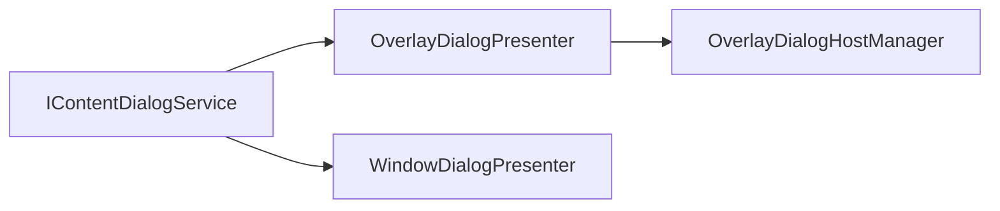

# Avalonia dialog presenters (`MyNet.Avalonia.Extended`)

Adapter layer between **MyNet.UI** (`IContentDialogService`, `IDialogPresenter`) and Avalonia surfaces (overlay host + dedicated windows).

## Prerequisites

1. Register MyNet.UI dialogs and view locators (`AddDialogs`, `AddViewLocators`).
2. Register Avalonia presenters:

```csharp
services.AddAvaloniaDialogs(() => mainWindow);
```

3. Include Extended themes in `App.axaml` (`Themes/Generic.axaml` from **MyNet.Avalonia.Extended**).
4. Declare an `OverlayDialogHost` in your main window (see [Controls overlay README](../../MyNet.Avalonia.Controls/Dialogs/Overlay/README.md)).

## Architecture

| Component | Role |
|-----------|------|
| `DialogOptions.ForOverlay` / `ForWindow` | Factory methods; store `DialogHostRequest` in `Owner` |
| `OverlayDialogPresenter` (P=100) | Content/message box in `OverlayDialogHost` |
| `WindowDialogPresenter` (P=110) | `WindowDialog` / `WindowMessageBox` |
| `OverlayDialogBuilder` / `WindowDialogBuilder` | Create shells, wire `CloseRequested`, layout |
| `DialogSessionRegistry` | Track open dialogs for `CloseAsync` |



## Overlay dialogs

```csharp
var topLevelKey = OverlayDialogHostManager.GetTopLevelKey(mainWindow);

var overlayOptions = new OverlayDialogOptions
{
    CanLightDismiss = true,
    HorizontalAnchor = HorizontalPosition.Center,
    TopLevelKey = topLevelKey
};

var result = await contentDialogService.ShowAsync(
    viewModel,
    DialogOptions.ForOverlay(
        viewModel,
        isModal: true,
        overlayOptions,
        hostId: OverlayDialogHostManager.MainHostId));
```

`OverlayDialogPresenter.CanPresent` returns `false` until a host is registered for `(hostId, topLevelKey)`. Declare the host in XAML before showing overlay dialogs in production.

### `OverlayDialogOptions`

Passed through `DialogOptions.ForOverlay` → `DialogHostRequest.OverlayOptions`. Merged with options inferred from `ContentDialog` (title, close button).

| Property | Usage |
|----------|--------|
| `TopLevelKey` | Stable key from `GetTopLevelKey` (not `GetHashCode()`). |
| `FullScreen`, anchors, offsets | Layout on `OverlayDialog` |
| `CanLightDismiss` | Light dismiss; also OR'd with `CloseOnOverlayClick` on dialog options |
| `CanDragMove` | Drag the overlay chrome by its title area |
| `Severity`, `Buttons`, `Title` | Overlay message box chrome (when not left at defaults) |

## Window dialogs

```csharp
var result = await contentDialogService.ShowAsync(
    viewModel,
    DialogOptions.ForWindow(viewModel, isModal: true));

var messageBoxResult = await contentDialogService.ShowAsync<MessageBoxResult>(
    messageBoxViewModel,
    DialogOptions.ForWindow(messageBoxViewModel, isModal: true));
```

### Owner resolution

1. `DialogHostRequest.WindowOwner` when set in `ForWindow(..., owner: window)`.
2. Otherwise `DialogHostOptions.TopLevelProvider()` (typically main window).

### Window without owner

If no owner can be resolved, the presenter shows the window with `Show()` / `Show(owner)` and **waits until the window closes** (same path as non-modal). The parent is not blocked by `ShowDialog`; prefer always supplying an owner for true modal behaviour on desktop.

## Closing programmatically

```csharp
await contentDialogService.CloseAsync(dialogViewModel);
```

Uses `DialogSession.CloseVisual` for overlay shells, message boxes, and windows.

## Tests

| Project | Scope |
|---------|--------|
| `tests/MyNet.Avalonia.Extended.Tests` | `DialogResultMapper`, `DialogOptions.Resolve`, `OverlayDialogBuilder.MergeOptions` |
| `tests/MyNet.Avalonia.Extended.Headless.Tests` | Modal overlay presenter, window message box result |

```bash
dotnet test tests/MyNet.Avalonia.Extended.Tests
dotnet run --project tests/MyNet.Avalonia.Extended.Headless.Tests
```

## Related documentation

- Overlay host contract: `MyNet.Avalonia.Controls/Dialogs/Overlay/README.md`
- Package overview: `MyNet.Avalonia.Extended/README.md` (installation and feature list)
