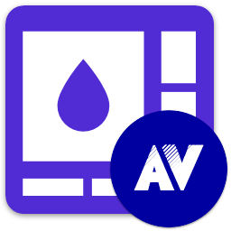

<div id="top"></div>

<!-- PROJECT INFO -->
<br />
<div align="center">
  
</div>

<h1 align="center">My .NET Avalonia Theme</h1>

[](https://github.com/sandre58/MyAvalonia/blob/main/LICENSE)
[](https://www.nuget.org/packages/MyNet.Avalonia.Theme)

Comprehensive theming system with custom styles, control templates, and visual resources for consistent UI design in Avalonia applications.

[](#)
[](#)
[](#)
[](#)
[](#)

---

## Installation

Install via NuGet:

```bash
dotnet add package MyNet.Avalonia.Theme
```

## Features

- **Complete Theme System** - Comprehensive theming with consistent visual design
- **Control Styles** - Custom styles for all standard Avalonia controls
- **Color Management** - Sophisticated color palette and theming system
- **Resource Dictionaries** - Organized resource management for themes and styles
- **Dark/Light Themes** - Support for multiple theme variants
- **Custom Templates** - Control templates for enhanced visual appearance
- **Typography** - Consistent font management and text styling
- **Converters** - Theme-aware value converters for data binding
- **Extensions** - Helper extensions for theme management
- **Cross-platform compatibility** - Consistent theming across Windows, macOS, and Linux


## Theme Usage & Configuration

MyNet.Avalonia.Theme provides a comprehensive theming system for Avalonia applications with consistent visual design and customization options.

### Basic Theme Setup

Apply the MyNet theme in your application's `App.axaml`:

```xml
<Application.Resources>
  <ResourceDictionary>
    <ResourceDictionary.MergedDictionaries>
      <ResourceDictionary Source="avares://MyNet.Avalonia.Theme/MyTheme.axaml" />
    </ResourceDictionary.MergedDictionaries>
  </ResourceDictionary>
</Application.Resources>
```

### Theme Variants

The theme system supports multiple variants:

```xml
<!-- Light theme variant -->
<ResourceDictionary Source="avares://MyNet.Avalonia.Theme/Themes/Light.axaml" />

<!-- Dark theme variant -->
<ResourceDictionary Source="avares://MyNet.Avalonia.Theme/Themes/Dark.axaml" />
```

### Custom Color Schemes

Override theme colors for custom branding:

```xml
<Application.Resources>
  <ResourceDictionary>
    <ResourceDictionary.MergedDictionaries>
      <ResourceDictionary Source="avares://MyNet.Avalonia.Theme/MyTheme.axaml" />
    </ResourceDictionary.MergedDictionaries>
    
    <!-- Custom color overrides -->
    <SolidColorBrush x:Key="ThemePrimaryBrush" Color="#FF6B46C1" />
    <SolidColorBrush x:Key="ThemeAccentBrush" Color="#FF10B981" />
  </ResourceDictionary>
</Application.Resources>
```


## Example Usage

### Theme Management in Code
```csharp
// Access theme resources programmatically
var themeResource = Application.Current.FindResource("ThemePrimaryBrush");
var primaryColor = ThemeResources.GetColor("Primary");

// Theme change notifications
ThemeResources.ThemeChanged += (sender, args) => {
    // React to theme changes
    UpdateUI();
};
```

### Custom Control Styling
```xml
<!-- Apply theme-aware styling to custom controls -->
<Style Selector="Button.Accent">
  <Setter Property="Background" Value="{DynamicResource ThemeAccentBrush}" />
  <Setter Property="Foreground" Value="{DynamicResource ThemeAccentForegroundBrush}" />
  <Setter Property="BorderBrush" Value="{DynamicResource ThemeAccentBrush}" />
</Style>

<Style Selector="TextBox.Modern">
  <Setter Property="Background" Value="{DynamicResource ThemeControlBackgroundBrush}" />
  <Setter Property="BorderBrush" Value="{DynamicResource ThemeBorderBrush}" />
  <Setter Property="CornerRadius" Value="8" />
</Style>
```

### Using Theme Converters
```xml
<!-- Theme-aware value converters -->
<Border Background="{Binding IsActive, 
                     Converter={StaticResource BooleanToThemeBrushConverter},
                     ConverterParameter='Success'}" />

<TextBlock Foreground="{Binding Priority,
                        Converter={StaticResource PriorityToColorConverter}}" />
```

### Resource Dictionary Structure
```xml
<!-- Organize custom themes in resource dictionaries -->
<ResourceDictionary xmlns="https://github.com/avaloniaui"
                    xmlns:x="http://schemas.microsoft.com/winfx/2006/xaml">
  
  <!-- Import base theme -->
  <ResourceDictionary.MergedDictionaries>
    <ResourceDictionary Source="avares://MyNet.Avalonia.Theme/MyTheme.axaml" />
  </ResourceDictionary.MergedDictionaries>
  
  <!-- Custom overrides -->
  <SolidColorBrush x:Key="CustomAccentBrush" Color="#FF6366F1" />
  <Thickness x:Key="CustomButtonPadding">12,8</Thickness>
</ResourceDictionary>
```

### Runtime Theme Switching
```csharp
// Switch themes at runtime
public void ApplyLightTheme()
{
    var lightTheme = new ResourceDictionary 
    { 
        Source = new Uri("avares://MyNet.Avalonia.Theme/Themes/Light.axaml") 
    };
    
    Application.Current.Resources.MergedDictionaries.Clear();
    Application.Current.Resources.MergedDictionaries.Add(lightTheme);
}

public void ApplyDarkTheme()
{
    var darkTheme = new ResourceDictionary 
    { 
        Source = new Uri("avares://MyNet.Avalonia.Theme/Themes/Dark.axaml") 
    };
    
    Application.Current.Resources.MergedDictionaries.Clear();
    Application.Current.Resources.MergedDictionaries.Add(darkTheme);
}
```

## License

Copyright © Stéphane ANDRE.

Distributed under the MIT License. See [LICENSE](../../LICENSE) for details.