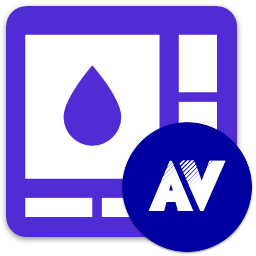

<div id="top"></div>

<!-- PROJECT INFO -->
<br />
<div align="center">
  
</div>

<h1 align="center">My .NET Avalonia UI</h1>

[](https://github.com/sandre58/MyAvalonia/blob/main/LICENSE)
[](https://www.nuget.org/packages/MyNet.Avalonia.UI)

High-level UI components and composite controls for rapid application development with Avalonia, providing rich functionality and user experience.

[](#)
[](#)
[](#)
[](#)
[](#)

---

## Installation

Install via NuGet:

```bash
dotnet add package MyNet.Avalonia.UI
```

## Features

- **Busy Indicators** - Loading states and progress indicators for long-running operations
- **Clipboard Services** - Enhanced clipboard operations and data management
- **Commands** - Advanced command implementations and UI command helpers
- **Dialogs** - Modal dialogs, message boxes, and custom dialog services
- **Controls** - High-level composite controls and UI components
- **Services** - UI services for navigation, notifications, and application management
- **Schedulers** - Task scheduling and background operation management
- **Theming** - Advanced theming services and theme management
- **Toasting** - Toast notifications and popup message system
- **Assists** - UI assistance utilities and helper components
- **Resource Management** - Advanced resource location and management services
- **Cross-platform compatibility** - Consistent UI experience across Windows, macOS, and Linux


## UI Services & Components

MyNet.Avalonia.UI provides high-level UI components and services for building rich Avalonia applications with enhanced user experience.

### Dialog Services

Easy-to-use dialog system for user interactions:

```csharp
// Show message dialogs
await DialogService.ShowMessageAsync("Information", "Operation completed successfully");
await DialogService.ShowErrorAsync("Error", "An error occurred during the operation");

// Show confirmation dialogs
var result = await DialogService.ShowConfirmationAsync("Confirm", "Are you sure you want to delete this item?");
if (result == DialogResult.Yes)
{
    // Perform deletion
}

// Show custom dialogs
var customResult = await DialogService.ShowDialogAsync<ContentDialogViewModel>();
```

### Toast Notifications

Non-intrusive notifications for user feedback:

```csharp
// Show simple toast notifications
ToastService.ShowSuccess("Item saved successfully");
ToastService.ShowError("Failed to save item");
ToastService.ShowWarning("Please check your input");
ToastService.ShowInfo("New update available");

// Custom toast with options
ToastService.Show(new ToastOptions
{
    Title = "Custom Toast",
    Message = "This is a custom toast notification",
    Type = ToastType.Success,
    Duration = TimeSpan.FromSeconds(5)
});
```

### Busy Indicators

Visual feedback for long-running operations:

```xml
<!-- Busy overlay for entire window -->
<Grid>
    <ContentControl Content="{Binding MainContent}" />
    <busy:BusyIndicator IsBusy="{Binding IsLoading}" 
                        BusyContent="Loading..." />
</Grid>
```


## Example Usage

### Service Configuration
```csharp
// Configure services in your application startup
public class App : Application
{
    public override void Initialize()
    {
        AvaloniaXamlLoader.Load(this);
        
        // Register UI services
        ServiceLocator.Register<IDialogService, DialogService>();
        ServiceLocator.Register<IToastService, ToastService>();
        ServiceLocator.Register<IClipboardService, ClipboardService>();
    }
}
```

### Advanced Commands
```csharp
// Commands with enhanced functionality
public class MainViewModel : ViewModelBase
{
    public IAsyncCommand SaveCommand { get; }
    public ICommand CancelCommand { get; }
    
    public MainViewModel()
    {
        SaveCommand = new AsyncRelayCommand(SaveAsync, CanSave);
        CancelCommand = new RelayCommand(Cancel);
    }
    
    private async Task SaveAsync()
    {
        IsBusy = true;
        try
        {
            await DataService.SaveAsync(Data);
            ToastService.ShowSuccess("Data saved successfully");
        }
        catch (Exception ex)
        {
            await DialogService.ShowErrorAsync("Error", ex.Message);
        }
        finally
        {
            IsBusy = false;
        }
    }
}
```

### Clipboard Operations
```csharp
// Enhanced clipboard functionality
public class ClipboardManager
{
    public async Task CopyToClipboardAsync(string text)
    {
        await ClipboardService.SetTextAsync(text);
        ToastService.ShowInfo("Copied to clipboard");
    }
    
    public async Task<string> PasteFromClipboardAsync()
    {
        if (await ClipboardService.ContainsTextAsync())
        {
            return await ClipboardService.GetTextAsync();
        }
        return string.Empty;
    }
}
```

### Theming Services
```csharp
// Theme management
public class ThemeManager : IThemeService
{
    public void ApplyTheme(string themeName)
    {
        var themeUri = $"avares://MyNet.Avalonia.UI/Themes/{themeName}.axaml";
        var theme = new ResourceDictionary { Source = new Uri(themeUri) };
        
        Application.Current.Resources.MergedDictionaries.Clear();
        Application.Current.Resources.MergedDictionaries.Add(theme);
        
        ThemeChanged?.Invoke(this, new ThemeChangedEventArgs(themeName));
    }
    
    public event EventHandler<ThemeChangedEventArgs> ThemeChanged;
}
```

### Composite Controls
```xml
<!-- High-level composite controls -->
<ui:DataEditForm DataContext="{Binding EditViewModel}"
                 SaveCommand="{Binding SaveCommand}"
                 CancelCommand="{Binding CancelCommand}"
                 ValidationService="{Binding ValidationService}" />

<ui:NavigationPanel Items="{Binding NavigationItems}"
                    SelectedItem="{Binding SelectedNavigation}"
                    NavigationCommand="{Binding NavigateCommand}" />
```

### Task Scheduling
```csharp
// Background task management
public class TaskScheduler : ISchedulerService
{
    public void ScheduleRecurringTask(string taskName, TimeSpan interval, Func<Task> taskFunc)
    {
        var timer = new Timer(async _ => await taskFunc(), null, TimeSpan.Zero, interval);
        _scheduledTasks.Add(taskName, timer);
    }
    
    public async Task RunBackgroundTaskAsync<T>(Func<Task<T>> taskFunc, Action<T> onCompleted)
    {
        BusyService.SetBusy(true);
        try
        {
            var result = await Task.Run(taskFunc);
            await Dispatcher.UIThread.InvokeAsync(() => onCompleted(result));
        }
        finally
        {
            BusyService.SetBusy(false);
        }
    }
}
```

## License

Copyright © Stéphane ANDRE.

Distributed under the MIT License. See [LICENSE](../../LICENSE) for details.